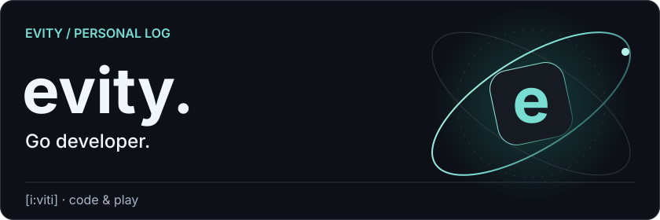
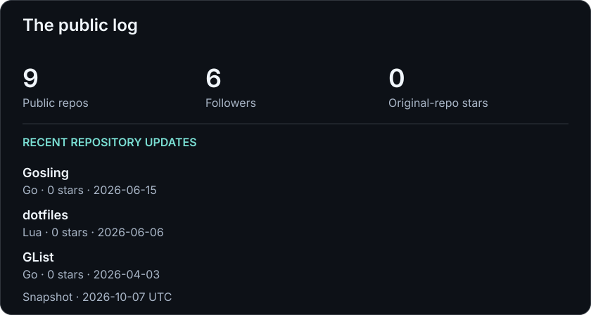
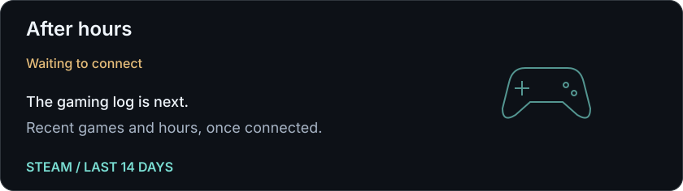

<picture>
  <source media="(max-width: 600px)" srcset="assets/header-mobile.svg">
  
</picture>

**Hi, I'm Evity.** `[i:viti]` · Go developer.

写代码，也留点时间玩游戏。

这里记录项目进展和游戏日常。

[Explore my repos](https://github.com/Evity?tab=repositories) · [Find me on GitHub](https://github.com/Evity)

### 01 / Code in motion

项目更新与 GitHub 数据。

<picture>
  <source media="(max-width: 600px)" srcset="assets/github-mobile.svg">
  
</picture>

### 02 / Beyond the editor

Steam 游戏记录 · 最近两周的游玩时光。

<picture>
  <source media="(max-width: 600px)" srcset="assets/steam-mobile.svg">
  
</picture>

<!-- PROFILE:START -->

数据详情 · 最近更新的项目与游戏记录

GitHub 快照：2026-10-06 13:21:17 UTC。

- 公开仓库：**9**
- 关注者：**6**
- 原创仓库 Stars：**0**

最近更新的原创公开仓库：

不含归档仓库。推送不等同于个人提交。

- [Gosling](https://github.com/Evity/Gosling) · Go · 0 stars · 2026-06-15
- [dotfiles](https://github.com/Evity/dotfiles) · Lua · 0 stars · 2026-06-06
- [GList](https://github.com/Evity/GList) · Go · 0 stars · 2026-04-03

Steam 尚未接入。

接入后展示两周游戏时长。

数据每 6 小时刷新；属于定时快照。

<!-- PROFILE:END -->

---

Code, play, repeat. · [动态内容配置](docs/dynamic-content.md)
